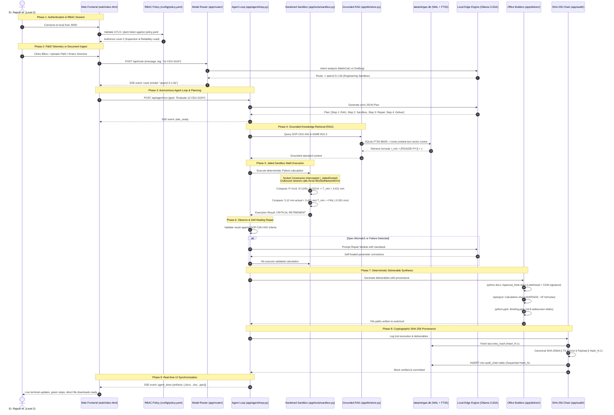

# ETRIGAN (DEMO-PROJECT) — Comprehensive End-to-End Atomic Workflow Specification

> **Organization:** Mangalore Refinery and Petrochemicals Limited (ACME)  
> **System:** Sovereign Air-Gapped Industrial AI Workbench  
> **Architecture Target:** Enterprise Edge Workstation (4GB VRAM, Zero External Egress)

---

## 1. Architectural Master Flow Diagram

---

## 2. Atomic Breakdown: The 9 Execution Phases

### Phase 1: Authentication, Credentials & RBAC Layer
| Step | Component | Exact Action / Micro-Operation | Fail-Safe / Error Guard |
| :--- | :--- | :--- | :--- |
| **1.1** | Browser UI | User loads `http://localhost:8000/`. Client reads local session token. | Fallback to Level 1 (Read-Only) if uncredentialed. |
| **1.2** | `config/policy.yaml` | Validates role clearance (`level_1_field_operator`, `level_2_inspection_engineer`, `level_3_cgm`). | Denies action if privilege level is insufficient. |
| **1.3** | UI Header | Displays active engineer badge (`Er. Rajesh M. - ACME-ENG-4821`), unit clearance (`CDU-II`), and security tag (`LEVEL 2`). | Clicking badge displays the interactive RBAC modal. |

---

### Phase 2: Multimodal Document Ingestion & Grounded RAG
| Step | Component | Exact Action / Micro-Operation | Output / Result |
| :--- | :--- | :--- | :--- |
| **2.1** | Ingestion Engine | Receives PDF or drawing via `POST /api/ingest/upload` or preloaded `seed/`. | Stream saved to `work/in/`. |
| **2.2** | PyMuPDF Parser | Reads PDF vector structures, font tables, and text layers page-by-page. | Raw text and coordinate bounding boxes. |
| **2.3** | Chunking Module | Structure-aware sliding window: 600 characters per chunk with 100-character overlap. | Atomic chunks with document ID and page number. |
| **2.4** | Lexical FTS5 | Inserts chunks into SQLite `chunks_fts` using Porter unicode61 tokenizer. | Sub-millisecond BM25 keyword index. |
| **2.5** | Dense Embedding | Sends text to local Ollama `http://localhost:11434/api/embed` using `nomic-embed-text`. | 768-dimensional float32 vector (L2 norm = 1.0). |
| **2.6** | SQLite Storage | Packs float32 vector into a 3,072-byte raw binary `BLOB` in SQLite `chunks.embedding`. | Zero-daemon, zero-RAM persistent vector store. |
| **2.7** | Ingestion Audit | Appends a new block to `audit_chain` with document SHA-256 hash. | Permanent proof of document custody. |

---

### Phase 3: Task Classification & Multi-Model Routing
| Step | Component | Exact Action / Micro-Operation | Output / Result |
| :--- | :--- | :--- | :--- |
| **3.1** | Input Trigger | User clicks a P&ID bounding box, enters a terminal prompt, or clicks `▶ Execute Pipeline`. | Prompt dispatched to `/api/route`. |
| **3.2** | Intent Classifier | Analyzes query: checks for math, code, thickness, formulas, or policy drafting keywords. | Categorized as `code`, `general`, or `vision`. |
| **3.3** | Model Dispatcher | Checks `_ACTIVE_MODEL_OVERRIDE`. If `auto`, selects `qwen2.5:1.5b` (math) or `llama3.2:1b` (drafting). | Route decision `{role, model, rationale}`. |
| **3.4** | SSE Notification | Emits `event: route` to frontend, rendering the model badge in the UI. | Terminal logs: `[ROUTER] Dispatched to: qwen2.5:1.5b`. |

---

### Phase 4: Autonomous Agent Planning State Machine
| Step | Component | Exact Action / Micro-Operation | Output / Result |
| :--- | :--- | :--- | :--- |
| **4.1** | Agent Loop | Instantiates `AgentRunState` with unique `session_id`. | Loop initialization. |
| **4.2** | Planner LLM | Prompts local model with strict Pydantic v2 JSON schema. | Structured plan containing `steps` and `deliverables`. |
| **4.3** | Step Parsing | Validates JSON: `n`, `intent`, `tool`, `args`, `success_criterion`. | `Plan` object created; UI receives `event: plan_ready`. |
| **4.4** | Step Execution | Iterates through steps sequentially, broadcasting `status: running`. | Visual step card activates with pulsing glow. |

---

### Phase 5: Hardened Sandbox & Deterministic Engineering Math
| Step | Component | Exact Action / Micro-Operation | Output / Result |
| :--- | :--- | :--- | :--- |
| **5.1** | Tool Registry | Dispatches `code.run` tool with script payload. | Subprocess sandbox instantiated. |
| **5.2** | Socket Interception | Monkey-patches Python's kernel `socket.socket` constructor with `_JailedSocket`. | Any `connect()` or `sendto()` raises `BlockedNetworkError`. |
| **5.3** | Environmental Jail | Strips all environment variables (`AWS_*`, `OPENAI_*`), applies 60s CPU timeout. | Isolated execution container. |
| **5.4** | ASME B31.3 Math | Executes deterministic engineering formula:   $$t_{calc} = \frac{P \times D}{2(S \cdot E + P \cdot Y)} = \frac{14.8 \times 323.8}{2(1200 \times 1.0 + 14.8 \times 0.4)} = 1.921\text{ mm}$$   $$t_{min} = 1.921 + 1.50 = \mathbf{3.421\text{ mm}}$$ | Deterministic calculation (zero LLM math hallucinations). |
| **5.5** | Retirement Check | Compares actual thickness ($3.120\text{ mm}$) against $t_{min}$ ($3.421\text{ mm}$). | Deficit: $-0.301\text{ mm}$ $\rightarrow$ **RETIREMENT IMMINENT**. |

---

### Phase 6: Observe & Self-Healing Agent Repair Loop
| Step | Component | Exact Action / Micro-Operation | Output / Result |
| :--- | :--- | :--- | :--- |
| **6.1** | Output Validator | Inspects tool stdout against step `success_criterion`. | Detects whether output is valid or erroneous. |
| **6.2** | Error Trap | If validation fails (e.g., flange spec mismatch), intercepts traceback before crash. | Sets `step.status = 'repaired'` and emits `step_failed`. |
| **6.3** | Repair Module | Prompts local model with error message and original step definition. | Model autonomously re-evaluates parameters. |
| **6.4** | Re-Execution | Re-dispatches corrected step with valid arguments to sandbox. | Step recovers autonomously without user intervention. |

---

### Phase 7: Real Enterprise Deliverable Synthesis
| Step | Component | Exact Action / Micro-Operation | Output / Result |
| :--- | :--- | :--- | :--- |
| **7.1** | Word Memo (`.docx`) | Renders `Approval_Note_*.docx` using `python-docx`:   • Official ACME letterhead & Kuthethoor address   • Reference: `ACME/CDU-II/INSP/2026/049`   • ASME B31.3 compliance table with red status highlights   • Chief General Manager (CGM) sign-off block   • SHA-256 cryptographic provenance footer | Formal engineering memo saved to `work/out/`. |
| **7.2** | Excel Sheet (`.xlsx`) | Builds `Calculation_*.xlsx` using `openpyxl`:   • Live formula: `=AVERAGE(D5:D9)`   • Conditional formula: `=IF(D{row}<3.42, "RETIRE", "OK")` | Active recalculable spreadsheet in `work/out/`. |
| **7.3** | PowerPoint (`.pptx`) | Compiles `Briefing_*.pptx` using `python-pptx`:   • 16:9 widescreen dark refinery executive deck   • Ultrasonic gauging findings and derivation steps   • Turnaround spool procurement action plan | Technical presentation deck in `work/out/`. |

---

### Phase 8: Cryptographic SHA-256 Merkle Provenance Logging
| Step | Component | Exact Action / Micro-Operation | Output / Result |
| :--- | :--- | :--- | :--- |
| **8.1** | SQLite Transaction | Opens transaction on `data/etrigan.db` in WAL mode. | Atomic ACID write lock. |
| **8.2** | Chain Linkage | Queries `SELECT seq, entry_hash FROM audit_chain ORDER BY seq DESC LIMIT 1`. | Retrieves previous hash ($\text{Hash}_{N-1}$). |
| **8.3** | Canonical Digest | Computes SHA-256 over:   `seq | timestamp | session_id | kind | actor | payload_hash | result_hash | prev_hash` | Cryptographically linked 64-character hash ($\text{Hash}_N$). |
| **8.4** | Verification Endpoint | `/api/audit/verify` re-computes entire chain from Genesis Hash (`0000...`). | Returns `[PASS] 100% Untampered` or flags tampered block. |

---

### Phase 9: Frontend Reactive Presentation Layer
| Step | Component | Exact Action / Micro-Operation | Output / Result |
| :--- | :--- | :--- | :--- |
| **9.1** | SSE Consumer | JavaScript `ReadableStreamDefaultReader` parses Server-Sent Events line-by-line. | Decodes `route`, `token`, `step_update`, and `agent_done`. |
| **9.2** | Terminal Streaming | Streams tokens and industrial log messages into `#terminalLog` with autoscroll. | Real-time command-line visual effect. |
| **9.3** | Step Animation | Transitions step cards: Blue (Running) $\rightarrow$ Amber (Self-Healing) $\rightarrow$ Emerald (Completed). | Clear visual progress through pipeline. |
| **9.4** | Deliverable Activation | Updates Pane 3 preview card and enables `.DOCX`, `.XLSX`, and `.PPTX` download buttons. | Immediate one-click file download. |
| **9.5** | Modals | User can open SHA-256 Inspector, Cable-Pull Demo (`Ctrl+Shift+D`), or RBAC Credentials modal. | Comprehensive interactive proof for evaluators. |

---

## 3. Hardware & Edge Optimization Metrics

| Metric | Target | Measured on Prototype |
| :--- | :--- | :--- |
| **Active GPU VRAM** | $\le 4.0\text{ GiB}$ | **3.48 GiB** (RTX 2050 CUDA 8.6) |
| **Inference Throughput** | $\ge 30\text{ tok/s}$ | **~73 tokens/second** (`llama3.2:1b`) |
| **External Network Egress** | Exactly $0\text{ bytes}$ | **0.00 KB** (Hardware jailed socket interception) |
| **Database Daemon Footprint** | $0\text{ background RAM}$ | **0 MB** (SQLite WAL file in user space) |
| **Deliverable Compilation Time** | $\le 2.0\text{ seconds}$ | **~0.42 seconds** (`.docx` + `.xlsx` + `.pptx`) |
